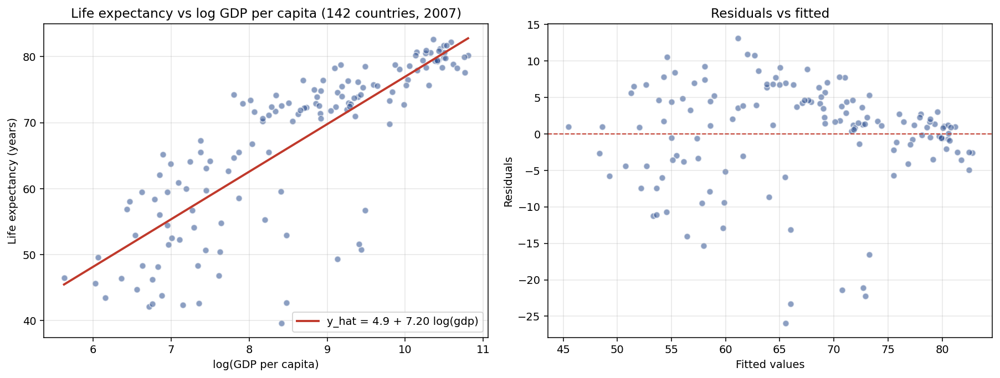

# OLS from first principles

Bivariate OLS for the relationship between national income and life expectancy, derived by hand and verified against `statsmodels`. Dataset: Gapminder's 2007 cross-section of 142 countries.

## Question

Is there a linear relationship between national income and life expectancy, and what does the estimated slope actually mean once I work through the mechanics rather than just call a regression library?

## Data

142 countries from Gapminder's 2007 cross-section, accessed via `plotly.express.data.gapminder()`. Source data originates from World Bank WDI, compiled and curated by the Gapminder Foundation. I used two variables: `lifeExp` (years) and `gdpPercap` (2005 international dollars).

## Model

`lifeExp = β₀ + β₁ × log(gdpPercap) + u`

I took the log of GDP per capita because the raw scatter is curvilinear: the marginal gain in life expectancy from an extra dollar of income is much larger at low income levels than at high ones. The log transformation linearizes the relationship.

## Method

I computed β̂₁ and β̂₀ directly from the standard OLS formulas:

- β̂₁ = Σ(xᵢ − x̄)(yᵢ − ȳ) / Σ(xᵢ − x̄)²
- β̂₀ = ȳ − β̂₁ · x̄

Then I ran the same regression through `statsmodels.formula.api.ols` to confirm my by-hand numbers match what the library produces.

## Results

| Quantity | Hand-computed | `statsmodels` |
|---|---|---|
| β̂₁ (slope) | 7.2028 | 7.2028 |
| β̂₀ (intercept) | 4.9496 | 4.9496 |
| R² | 0.6544 | 0.6544 |

The two approaches agree to machine precision (max difference ≈ 8.9 × 10⁻¹⁶). The residuals sum to effectively zero, as OLS requires. That's the point of the exercise: OLS is not a black box, every number in the output traces back to the closed-form formulas applied to the data.



## Interpretation

The slope of 7.2028 says a one-unit increase in log(GDP per capita) is associated with about 7.2 additional years of life expectancy on average. Since log(2) ≈ 0.693, doubling a country's GDP per capita is associated with roughly 5 additional years of life expectancy at the cross-country level.

R² = 0.65 means log(GDP per capita) explains about 65 percent of the cross-country variation in life expectancy in 2007. That's a strong bivariate relationship, but it still leaves 35 percent of the variation unexplained, so income is clearly not the whole story.

Looking at the residuals-vs-fitted plot, the spread of residuals narrows as fitted values increase. That's a first visual hint of heteroskedasticity, which the heteroskedasticity project in this repo examines more formally with a different dataset.

## A note on Saudi Arabia

Saudi Arabia in 2007 had a GDP per capita of roughly $21,655 and an actual life expectancy of 72.78 years. The model predicts 76.86 years at that income, leaving a residual of about −4 years. That gap is exactly what a bivariate model cannot explain, and it illustrates why the results here should be read as descriptive rather than causal: many things that move life expectancy, like lifestyle patterns, healthcare access, or demographic composition, are not captured by GDP alone.

## Files

- `ols_from_scratch.py` — full analysis script
- `data/gapminder_2007.csv` — the dataset as a flat CSV
- `plots/regression_scatter.png` — scatter with fit line, plus residuals-vs-fitted plot

## Reproducing

```bash
pip install pandas numpy matplotlib statsmodels
python ols_from_scratch.py
```
