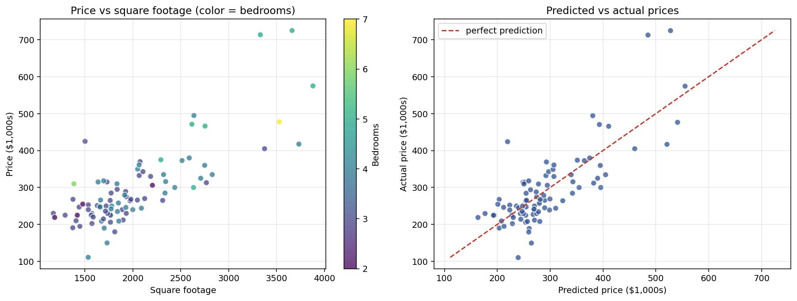

# Housing price determinants

Multiple regression on 88 houses, estimating how bedrooms and square footage jointly explain price. The main analytical point is that the bedroom coefficient changes substantially once square footage is added, which illustrates what multiple regression actually buys you relative to bivariate regression.

## Question

What do bedrooms and square footage each contribute to the price of a house, and how does the answer change when both variables are considered together?

## Data

`hprice1.dta` from Jeffrey Wooldridge's econometrics textbook, containing 88 houses with data on price, bedrooms, square footage, and other characteristics. The sample is a snapshot of 1990 Boston suburban housing. I exported it to CSV for portability.

| Variable | Description |
|---|---|
| `price` | House price in $1,000s |
| `bdrms` | Number of bedrooms |
| `sqrft` | Total square footage |

## Method

I fit two models:

- **Bivariate:** `price = β₀ + β₁ bdrms + u`
- **Multiple:** `price = β₀ + β₁ bdrms + β₂ sqrft + u`

The comparison is deliberate. The bivariate specification tells us the average price of houses with different bedroom counts. The multiple specification tells us how price changes with bedrooms when total square footage is held fixed. These are different questions, and the coefficients reflect that.

## Results

### Model 1: bivariate

| Variable | Coefficient | Std. Error | t | p-value |
|---|---|---|---|---|
| Intercept | 72.23 | 41.55 | 1.74 | 0.086 |
| bdrms | **62.02** | 11.34 | 5.47 | **0.000** |

R² = 0.258

The bivariate regression says an extra bedroom is associated with about $62,000 in price, and the effect is highly significant.

### Model 2: with square footage

| Variable | Coefficient | Std. Error | t | p-value |
|---|---|---|---|---|
| Intercept | −19.32 | 31.05 | −0.62 | 0.536 |
| bdrms | **15.20** | 9.48 | 1.60 | 0.113 |
| sqrft | **0.128** | 0.014 | 9.29 | 0.000 |

R² = 0.632, F-statistic = 72.96 (p < 0.001)

Once I add square footage, the bedroom coefficient falls from $62,000 to about $15,000, and it is no longer statistically significant at the 5 percent level. The square footage coefficient says each additional square foot is associated with $128 in price, which is highly significant. R² jumps from 0.26 to 0.63.



## Interpretation

The collapse of the bedroom coefficient is not a bug, it is the whole point of multiple regression. Bedrooms and square footage are correlated in this sample (r = 0.53), because houses with more bedrooms tend to be bigger. The bivariate regression mixes two effects: the direct value of an extra bedroom, and the indirect value from the fact that more-bedroom houses are also larger.

Once I hold square footage constant, what remains is the pure bedroom effect, and it is small. That makes economic sense: for a fixed total size, adding a bedroom means carving the existing space into more rooms, each one smaller. The market does not reward that very much in this sample. What buyers pay for is total space.

This is the cleanest kind of illustration of omitted variable bias. The bivariate model overstates the bedroom coefficient because it implicitly credits bedrooms for the effect of size.

## Application: the friend's house

A friend bought a house with 4 bedrooms and 2,438 square feet for $300,000. Does the model suggest he overpaid or underpaid?

Plugging those characteristics into the multiple regression:

```
predicted price = −19.32 + (15.20 × 4) + (0.128 × 2438) = $354.6 thousand
```

The model predicts roughly **$354,600** for a house like that, so at $300,000 he actually **underpaid** by about **$54,600** relative to the model's estimate.

That said, the 95 percent prediction interval for a single new house with these characteristics runs from about **$228,000 to $481,000**. That is a very wide band, and $300,000 sits well inside it. So while the point estimate says he got a deal, we cannot statistically reject the idea that $300,000 is a fair price. A two-variable model cannot capture neighborhood, lot size, condition, year of sale, or anything else that actually moves house prices in reality.

## Files

- `housing_analysis.py` — full analysis script
- `data/hprice1.csv` — the 88-house sample
- `plots/housing_regression.png` — price vs sqrft scatter with bedroom coloring, plus predicted vs actual

## Reproducing

```bash
pip install pandas numpy matplotlib statsmodels
python housing_analysis.py
```
