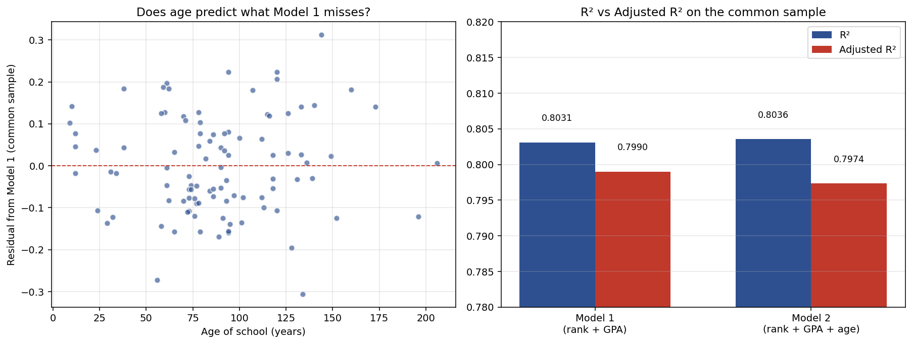

# The R-squared puzzle: law school salaries

Why can R-squared sometimes appear to fall when you add a variable to a regression? The textbook answer is that it cannot, so when it seems to, something else is going on. This project works through a specific case using 1985 U.S. law school data, and shows that two distinct issues can produce the illusion: sample changes from missing data, and the R-squared / adjusted R-squared distinction.

## Question

Fit `log(salary) = β₀ + β₁·rank + β₂·GPA + u`, then add age of the law school as a third regressor. The R-squared falls. Why?

## Data

`lawsch85.dta` from Jeffrey Wooldridge's econometrics textbook, containing 156 U.S. law schools observed in 1985. I exported the relevant columns to CSV.

| Variable | Description |
|---|---|
| `lsalary` | Log of median starting salary of graduates |
| `rank`    | School ranking (lower rank = better school) |
| `GPA`     | Median GPA of the entering class |
| `age`     | Age of the law school, in years since founding |

Missing values matter for this project:

| Variable | Missing |
|---|---|
| `rank` | 0 |
| `lsalary` | 8 |
| `GPA` | 7 |
| `age` | **45** |

## The apparent puzzle

**Model 1** fits `lsalary` on rank and GPA, and uses 142 schools. **Model 2** adds age, and drops to 99 schools because of age's missing values.

| Model | N | R² | Adj R² |
|---|---|---|---|
| 1: rank + GPA | 142 | **0.8238** | 0.8212 |
| 2: rank + GPA + age | 99 | **0.8036** | 0.7974 |

R-squared appears to fall from 0.8238 to 0.8036 when a variable is added. That contradicts the theoretical result that OLS R-squared is non-decreasing in covariates.

## Diagnosis: the samples are different

The simplest explanation is that Model 1 and Model 2 are fit on different data. Model 1 uses 142 schools. Model 2 uses 99 schools, because 43 additional schools are dropped when age is required to be non-missing. Comparing R-squared across models on different samples is not a valid comparison in the first place.

## The apples-to-apples comparison

To actually test whether adding age helps the fit, I refit Model 1 on the same 99-school sample that Model 2 uses:

| Model (N = 99 common sample) | R² | Adj R² |
|---|---|---|
| 1: rank + GPA | 0.8031 | 0.7990 |
| 2: rank + GPA + age | 0.8036 | **0.7974** |
| **Change** | **+0.0005** | **−0.0016** |

On the common sample, R-squared rises by half of one-tenth of one percent, which is what the theory says should happen. Adjusted R-squared falls.



## Why adjusted R² falls even though R² rises

Adjusted R-squared penalizes extra regressors that do not pull their weight. The formula is:

```
Adj R² = 1 − (1 − R²)·(N − 1)/(N − k − 1)
```

where k is the number of regressors. Adding a variable increases k by 1, which shrinks the denominator. For adjusted R-squared to rise, the gain in R-squared has to be bigger than this df penalty. Here it is not, because the coefficient on age is essentially zero:

```
age coefficient: 0.0002   (std err 0.0005,  t = 0.47,  p = 0.64)
```

Age does not meaningfully predict log salary once rank and GPA are in the model. The left panel of the plot above confirms it visually: the residuals from Model 1 show no systematic relationship with age.

## Takeaways

1. R-squared can only appear to fall across models when the samples differ. On a fixed sample, adding a variable can never decrease R-squared.
2. Adjusted R-squared can fall, and that is by design. It fell here because age's contribution did not overcome the penalty for the extra degree of freedom.
3. Both effects matter in practice. Adjusted R-squared is the right tool to compare models on the same sample. Sample comparability is the first thing to check when models look like they disagree.

## Files

- `law_school_analysis.py` — full analysis
- `data/lawsch85.csv` — 156 law schools, relevant columns only
- `plots/rsquared_puzzle.png` — residuals vs age and R²/Adj R² comparison

## Reproducing

```bash
pip install pandas numpy matplotlib statsmodels
python law_school_analysis.py
```
