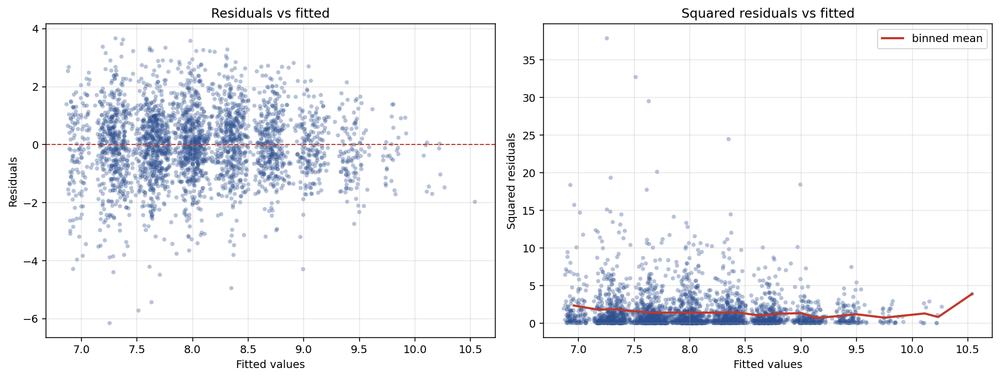

# Heteroskedasticity in medical spending

A log-linear regression of annual medical expenditure on demographic and health variables, with heteroskedasticity diagnostics and a comparison of inference under default vs robust standard errors. The practical finding is that the Gauss-Markov homoskedasticity assumption is decisively rejected by the data, but the change in standard errors is modest in this sample.

## Question

When we regress log medical expenditures on age, chronic conditions, income, and other demographics, does the classical OLS homoskedasticity assumption hold? If it does not, how much do our conclusions actually change when we switch to heteroskedasticity-robust standard errors?

## Data

Medical Expenditure Panel Survey (MEPS), 2003 wave, U.S. adults aged 65 and older. Source dataset is the `mus03data` extract used in Cameron and Trivedi's *Microeconometrics Using Stata*. I restricted the sample to respondents with positive annual medical expenditure, giving 2,955 observations, and constructed `lntotexp` as the natural log of `totexp`.

| Variable | Description |
|---|---|
| `lntotexp` | Natural log of annual total medical expenditure |
| `age` | Age in years (65-90) |
| `totchr` | Number of chronic conditions (0-7) |
| `income` | Household income, $1,000s |
| `female` | 1 if female |
| `suppins` | 1 if has supplemental private insurance |
| `phylim` | 1 if has any physical limitations |
| `actlim` | 1 if has any activity limitations |

## Model

```
lntotexp = β₀ + β₁·age + β₂·totchr + β₃·income + β₄·female
           + β₅·suppins + β₆·phylim + β₇·actlim + u
```

## Results

### OLS with default standard errors

| Variable | Coefficient | Std. Error | t | p-value |
|---|---|---|---|---|
| Intercept | 6.7037 | 0.277 | 24.22 | 0.000 |
| age | 0.0038 | 0.004 | 1.04 | 0.299 |
| totchr | **0.3758** | 0.018 | 20.40 | **0.000** |
| income | 0.0025 | 0.001 | 2.50 | 0.012 |
| female | −0.0843 | 0.046 | −1.85 | 0.064 |
| suppins | **0.2556** | 0.046 | 5.53 | **0.000** |
| phylim | 0.3021 | 0.057 | 5.30 | 0.000 |
| actlim | 0.3560 | 0.062 | 5.73 | 0.000 |

R² = 0.229. Most coefficients are significant at the 1 percent level. Age is the only clear null. Female is marginal (p ≈ 0.064).

### Coefficient interpretations (log-level)

Since the dependent variable is logged, coefficients approximate proportional differences. Taking exp(coef) − 1 gives the exact percent change:

- **Each additional chronic condition** is associated with **+45.6%** more medical spending
- **Having supplemental insurance** is associated with **+29.1%** more spending, which is consistent with insured patients consuming more care (a classic moral-hazard finding in health economics)

## Heteroskedasticity diagnostics



The left panel shows the residuals are not a symmetric cloud around zero. There is a long negative tail at lower fitted values, which is what happens when expenditures are bounded below by the log transform but the raw scale is skewed. The right panel plots squared residuals against fitted values with a binned-mean overlay, which makes heteroskedasticity more visible than the raw residual plot: the conditional variance is clearly not constant.

Two formal tests confirm the visual impression:

| Test | LM statistic | p-value | Conclusion |
|---|---|---|---|
| Breusch-Pagan | 93.13 | 2.8 × 10⁻¹⁷ | Reject homoskedasticity |
| White | 139.90 | 8.8 × 10⁻¹⁶ | Reject homoskedasticity |

Both tests reject the null of constant error variance at any conventional level. There is heteroskedasticity in this model.

## Robust standard errors

Refitting the same model with heteroskedasticity-robust standard errors (HC1, which is Stata's default):

| Variable | Coef | SE (default) | SE (robust) | p (default) | p (robust) | % change in SE |
|---|---|---|---|---|---|---|
| age | 0.0038 | 0.0037 | 0.0037 | 0.299 | 0.305 | +1.3% |
| totchr | 0.3758 | 0.0184 | 0.0187 | 0.000 | 0.000 | +1.6% |
| income | 0.0025 | 0.0010 | 0.0010 | 0.012 | 0.015 | +2.7% |
| female | −0.0843 | 0.0455 | 0.0457 | 0.064 | 0.065 | +0.2% |
| suppins | 0.2556 | 0.0462 | 0.0466 | 0.000 | 0.000 | +0.8% |
| phylim | 0.3021 | 0.0570 | 0.0577 | 0.000 | 0.000 | +1.3% |
| actlim | 0.3560 | 0.0621 | 0.0634 | 0.000 | 0.000 | +2.1% |

## Interpretation

The heteroskedasticity tests give a very decisive answer: the null of constant variance is rejected at any level you'd pick. That means the default OLS standard errors are, technically, not quite right.

But when I look at how much the standard errors actually move once I apply the HC1 correction, the change is small. Robust standard errors are 0 to 3 percent larger than default standard errors across all coefficients, and no variable changes its statistical significance conclusion between the two specifications. The substantive findings are robust: chronic conditions and disability strongly predict higher medical spending, supplemental insurance is associated with about 29 percent more spending, income has a small positive effect, and age by itself adds nothing once other covariates are in the model.

The right lesson is not "heteroskedasticity is present so the OLS results are invalid." It is more nuanced: robust standard errors are the defensible default because they protect against heteroskedasticity when it is there, and they cost almost nothing in finite-sample efficiency when it is not. In this specific model and sample the correction happened to be minor, but I still report robust SEs because I have tested and found heteroskedasticity, and reporting conclusions that depend on an assumption I know to be violated would be intellectually sloppy.

## Files

- `het_analysis.py` — full analysis
- `data/mus03data.csv` — 2,955 observations with the variables used
- `plots/heteroskedasticity_diagnostics.png` — residuals-vs-fitted and squared-residuals-vs-fitted plots

## Reproducing

```bash
pip install pandas numpy matplotlib statsmodels
python het_analysis.py
```
